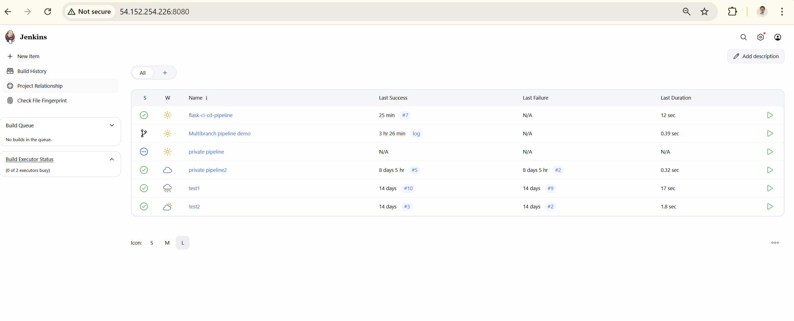
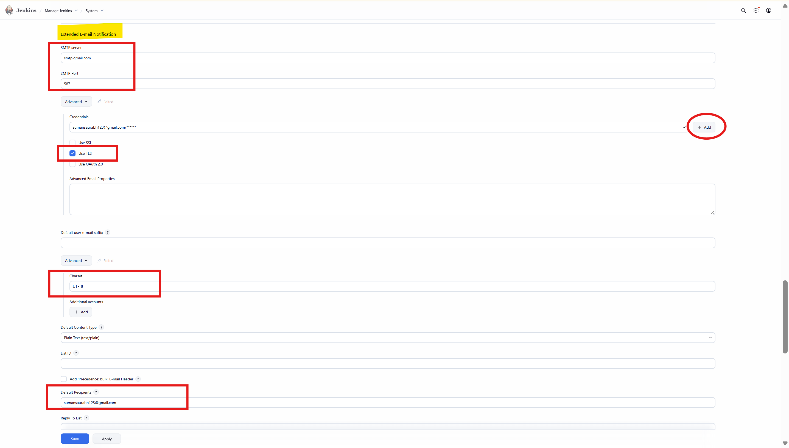
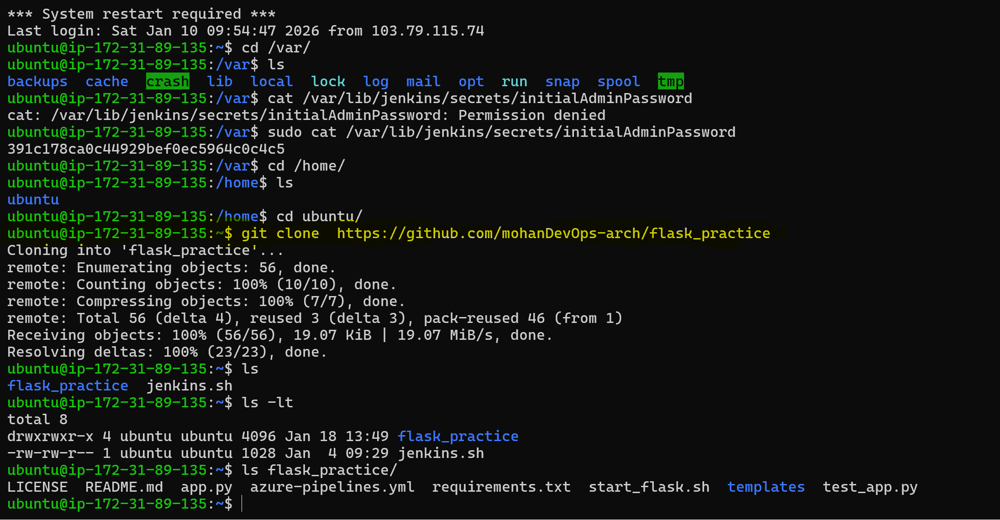
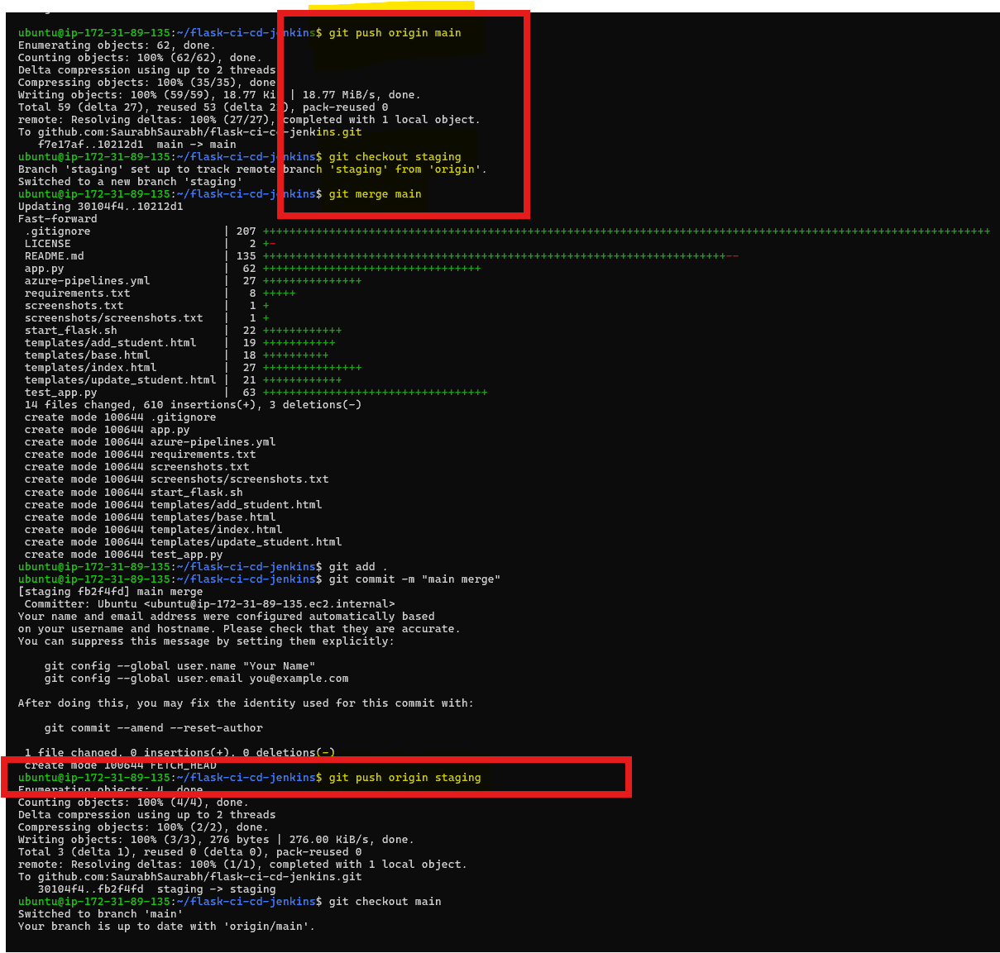
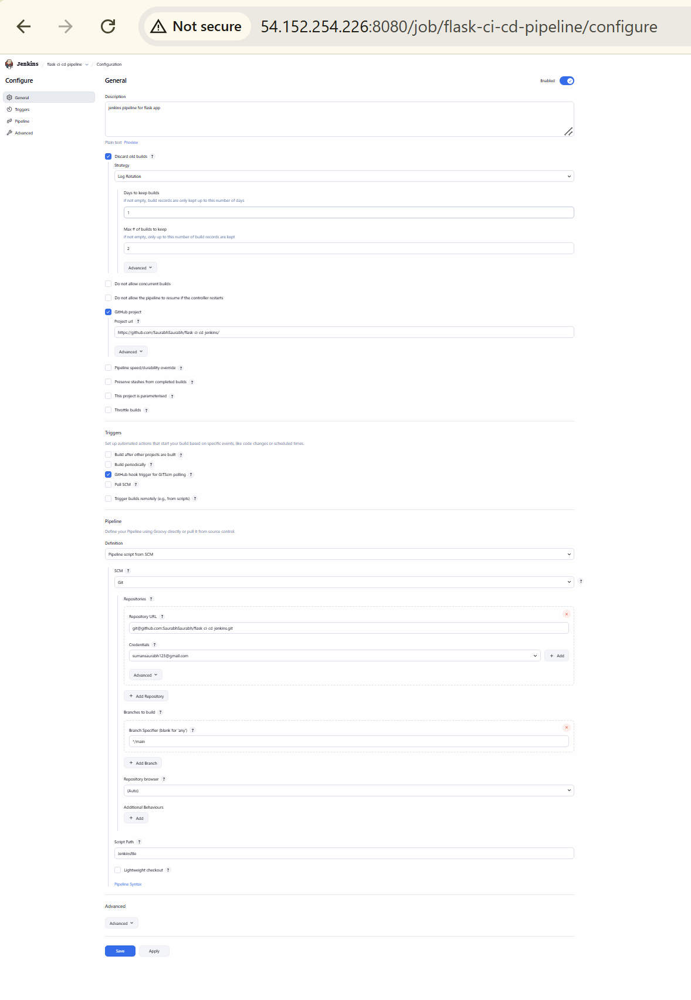
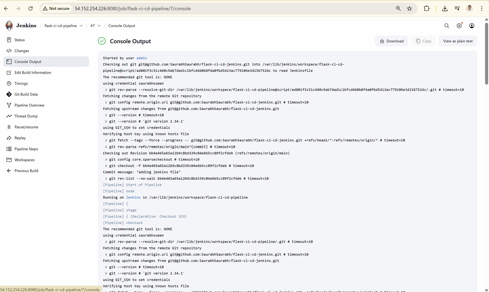
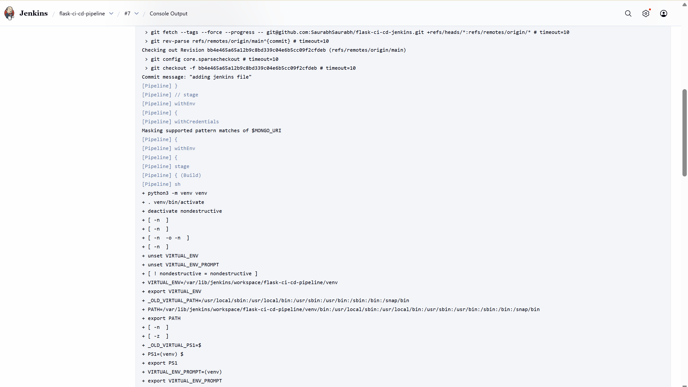
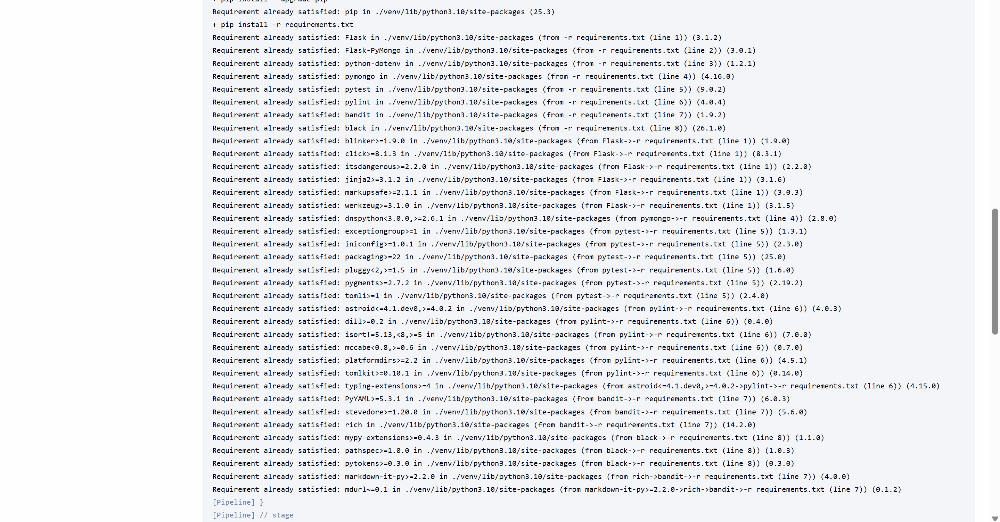
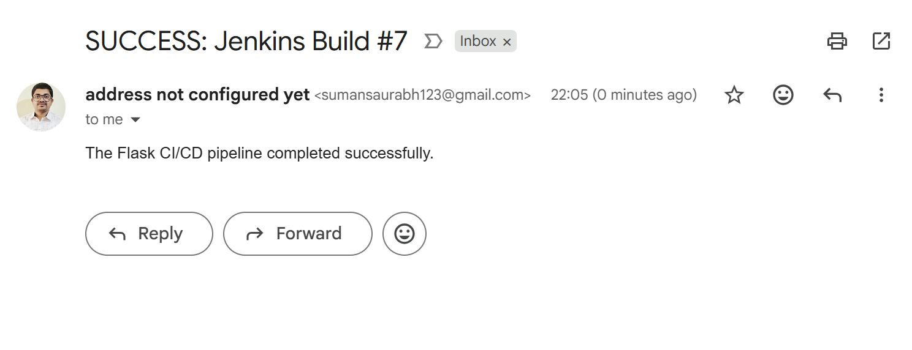

# 🚀 CI/CD with Jenkins

---

## 1️⃣ Objective
Set up a Jenkins CI/CD pipeline that:
- Pulls code from GitHub  
- Builds and tests automatically  
- Sends email notifications (via Gmail SMTP)  
- Optionally deploys artifacts  

---

## 2️⃣ Prerequisites
- **Ubuntu server / EC2 instance** with Jenkins installed  
- **Java & Maven** (or Node.js, depending on project)  
- **GitHub repository** with sample project  
- **Gmail App Password** for SMTP  
- Installed Jenkins plugins:
  - GitHub Integration  
  - Pipeline  
  - Email Extension (emailext)  

---

## 3️⃣ Jenkins Setup
1. **Install Jenkins**  
   ```bash
   sudo apt update
   sudo apt install openjdk-11-jdk -y
   wget -q -O - https://pkg.jenkins.io/debian-stable/jenkins.io.key | sudo apt-key add -
   sudo sh -c 'echo deb http://pkg.jenkins.io/debian-stable binary/ > /etc/apt/sources.list.d/jenkins.list'
   sudo apt update
   sudo apt install jenkins -y
   sudo systemctl enable jenkins
   sudo systemctl start jenkins
   ```

2. **Access Jenkins**  
   - Open browser → `http://<server-ip>:8080`  
   - Unlock Jenkins with initial admin password (`/var/lib/jenkins/secrets/initialAdminPassword`)
   - Jenkins Dashboard →
     

3. **Install Plugins**  
   - Go to **Manage Jenkins → Plugins → Available**  
   - Install **Pipeline** and **Email Extension Plugin**  

---

## 4️⃣ Configure SMTP (Gmail TLS)
- Go to **Manage Jenkins → Configure System → Extended E‑mail Notification**  
- Fill in:
  - **SMTP server**: `smtp.gmail.com`  
  - **SMTP Port**: `587`  
  - **Use TLS**: ✔️  
  - **Authentication**: ✔️  
    - Username: `sumansaurabh123@gmail.com`  
    - Password: Gmail App Password  
  - Email configuration →
     


---

## 5️⃣ flask app with Jenkinsfile Example  
- Create github repo like https://github.com/SaurabhSaurabh/flask-ci-cd-jenkins
- Clone repo for flask app →
  
- Copy the files to new repo and commit. Also create staging branch and merge with main.
  

- Add Jenkinsfile to main and staging branch.
```groovy
pipeline {
    agent any
    stages {
        stage('Checkout') {
            steps {
                git branch: 'main', url: 'https://github.com/username/repo.git'
            }
        }
        stage('Build') {
            steps {
                sh 'mvn clean install'
            }
        }
        stage('Test') {
            steps {
                sh 'mvn test'
            }
        }
    }
    post {
        success {
            emailext(
                subject: "✅ Build Success: ${env.JOB_NAME} #${env.BUILD_NUMBER}",
                body: "The build succeeded!\nCheck console output at ${env.BUILD_URL}",
                to: "sumansaurabh123@gmail.com, saiyedin786@gmail.com"
            )
        }
        failure {
            emailext(
                subject: "❌ Build Failed: ${env.JOB_NAME} #${env.BUILD_NUMBER}",
                body: "The build failed.\nCheck console output at ${env.BUILD_URL}",
                to: "sumansaurabh123@gmail.com, saiyedin786@gmail.com"
            )
        }
    }
}
```
---

## 6️⃣ Create Pipeline Job
1. Go to **New Item → Pipeline**  
2. Link to your GitHub repo (with Jenkinsfile).  
3. Save.
- Pipeline Config → 

---

## 7️⃣ Results
- Code automatically built and tested on commit.   
  Build Execution →
  
  
  
  
  
- Notifications sent via Gmail SMTP.  
  Email Notification →
  
  

---

## 📚 Learnings & Extra Setup

- **SMTP with Gmail**  
  - Use **App Passwords** instead of your main Gmail password for Jenkins/MSMTP.  
  - Always enable **TLS on port 587** (port 25 is often blocked on cloud servers).  

- **Jenkins Credentials Storage**  
  - Store sensitive values (like Gmail App Passwords, AWS keys, tokens) in **Jenkins → Manage Jenkins → Credentials**.  
  - Reference them in pipelines using `credentialsId`.  
  - Example:
    ```groovy
    withCredentials([usernamePassword(credentialsId: 'gmail-creds', usernameVariable: 'USER', passwordVariable: 'PASS')]) {
        emailext(
            subject: "Build Notification",
            body: "Pipeline finished",
            to: "sumansaurabh123@gmail.com",
            mimeType: 'text/plain'
        )
    }
    ```
  - This avoids hardcoding passwords in Jenkinsfile.

- **Environment Variables**  
  - Use `Manage Jenkins → Configure System → Global properties → Environment variables` to define reusable values (e.g., repo URL, build tool path).  
  - Access them in pipelines with `env.VARIABLE_NAME`.

- **Pipeline Best Practices**  
  - Always include `post { success { ... } failure { ... } }` blocks for notifications.  
  - Keep Jenkinsfile modular: separate stages for checkout, build, test, deploy.  
  - Use `agent any` for flexibility, or define specific agents if needed.

- **Troubleshooting SMTP**  
  - `Connection refused` → No SMTP service running on localhost; use Gmail directly.  
  - `Permission denied` → Logfile ownership issue; fix with `chown ubuntu:ubuntu`.  
  - `Auth failed` → Wrong Gmail App Password or 2FA not enabled.

- **Extra Config Learnings**  
  - Extended E‑mail Plugin (`emailext`) is more powerful and recommended for pipelines.  
  - Use `text/html` for rich email formatting.  
  - You can send to multiple recipients by separating with commas.


